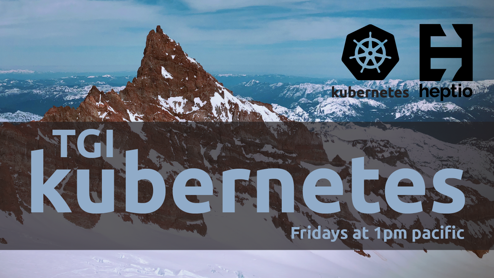

Official repository for Heptio TGIK!

Heptio TGIK is a weekly live video stream that we broadcast live from the Heptio headquarters in Seattle, Washington all about Kubernetes.

The [index](playlist.md) contains a list of all episodes.

The [official YouTube channel can be found here](https://j.hept.io/tgik).

There is a community driven list of episodes that can be found [here](https://github.com/recollir/tgik-playlist) (Thanks to [recollir](https://github.com/recollir)!)

## Suggest an episode

If you have an idea for TGIK please [open an issue in the TGIK issue tracker](https://github.com/heptio/tgik/issues/new).
We pick the episodes as we see fit with what's happening in the community.
If we select your suggestion we will link back to your original work here!

