# TGIK Documentation

This will mostly be internal, but sharing broadly as a resource.

## Creating the Checklist

Start by copying the following into the issue for the episode. Check things off as you do them.

```markdown
The process for producing an episode is [here](https://github.com/vmware-tanzu/tgik/blob/master/documentation/README.md).  All the detail for the steps below is there.

Monday or Tuesday:
* [ ] Pick a topic and create/use an issue in the repo
* [ ] If applicable coordinate with an upstream project if they're interested in attending the show
* [ ] Create the graphic
* [ ] Schedule on Youtube
* [ ] Add scheduled episode to TGIK playlist on YT
* [ ] Create short link in rebrandly
* [ ] Tweet about it from your personal account
  * [ ] Post tweets on internal #tgik slack channel and cc  Vykky

Before episode:
* [ ] Create HackMD page for live notes.  Start with README template in this repo
* Show Coordination with Assistant (if you have one)
  * [ ] Paste HackMD URL on internal #tgik channel
  * [ ] Assistant adds ~5-10 news items from around the web as possible "News of the Week"
  * [ ] Confirm show time and AV check 
  * [ ] Last minute retweets or topic updates
  * [ ] Sync with external guest one last time if necessary
* [ ] Get everything tested well before episode so you can debug
* [ ] Use internal slack channel to ensure that AV se tup is good

After show (ideally right away but can wait until Monday):
* Create/submit PR for this repo
  * [ ] Episode directory and README from hackmd
  * [ ] Any other files from the episode that might be useful
  * [ ] Update playlist.md with episode
  * Feel free to self merge
* [ ] Edit YT description to point to episode directory here
* [ ] OBS/OS Upgrade if applicable (Never on the day of a show)
```

## Creating the graphic

Find an image to use that is fun and subtly hints at the topic for the episode.
For example [episode 38](https://github.com/vmware-tanzu/tgik/tree/master/episodes/038) was on Kata containers, and the [supporting image was of containers in a shipyard](https://github.com/vmware-tanzu/tgik/blob/master/episodes/038/038.png).

You will need the [Ubuntu Bold](https://www.fontzillion.com/fonts/dalton-maag-ltd/ubuntu) font if you don't have it already.

#### [Adobe Illustrator](https://www.adobe.com/products/illustrator.html) (Mac/Windows):

1. Open `graphics/title-card.ai` with Adobe Illustrator.
1. Delete the old image and use the "File | Place" to insert the new image. Move that to the back with "Object | Arrange | Send to Back".
1. Select the semi-transparent background on the text and the logo box and use the eye dropper tool to pick a light color out of the image.
1. Export to PNG in the same folder using "File | Export | Export for screens"
  * Before saving make sure you change the name of the artboard (which determines the filename) by double clicking it on that dialog.
  * Export as PNG at 1x
  
#### [Inkscape](https://inkscape.org/) (Linux/Mac/Windows):

1. Open `graphics/title-card.svg` with inkscape.
 
    ```bash
    inkscape graphics/title-card.svg
    ```

1. Open the layers panel (`ctrl+shift+L`).

    [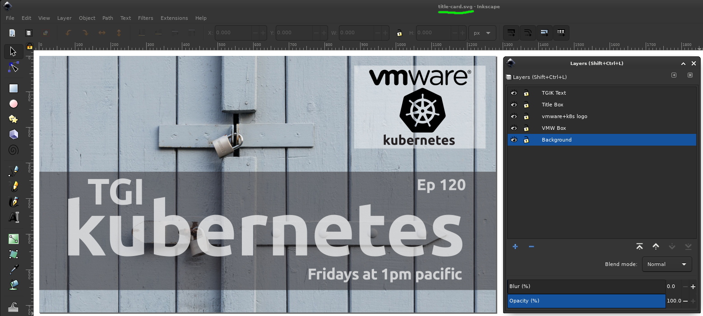](imgs/inkscape-open.png)

1. Select the background image (ensure `Background` layer is selected).
1. Right click on the background image.
1. Choose `Release Clip`.
 
    [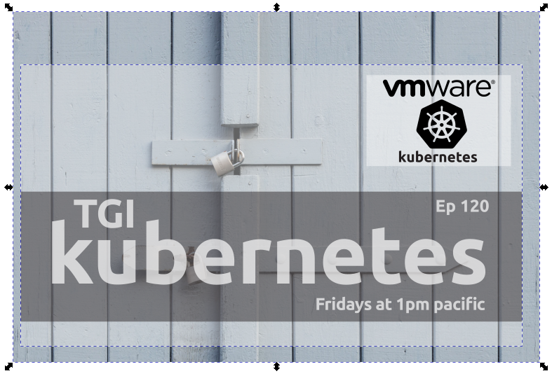](imgs/inkscape-release-clip.png)
    > This reveals two objects in the layer `Background`. The background image, which you'll replace, and a semi-transparent box representing the 1280x720 area to trim a background image to.

1. Delete the existing background image.
1. Paste in a new background image.
    * We often use [unsplash.com](https://unsplash.com/); If not unsplash, ensure we have rights to use the image.
1. Move the new background image object behind the semi-transparent box 
    * `PgDn` or `Menu Bar > Object > Lower to Bottom`
1. Move/Scale the background image around to fit desirably in the semi-transparent box.
1. Select the background image and semi-transparent box.
1. Right click and `Set Clip`.
 
    [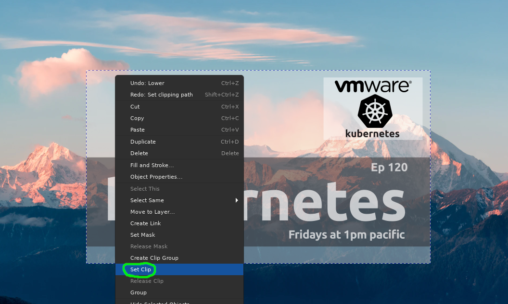](imgs/inkscape-set-clip.png)

1. Use the Text Tool (`T`) to update the episode number (`Ep 120` -> `Ep 121`).

1. Select all semi-transparent elements (text + vmware/k8s background) 
 
1. Set their color by using the dropper (`D`) and clicking somewhere in the image.
 
    [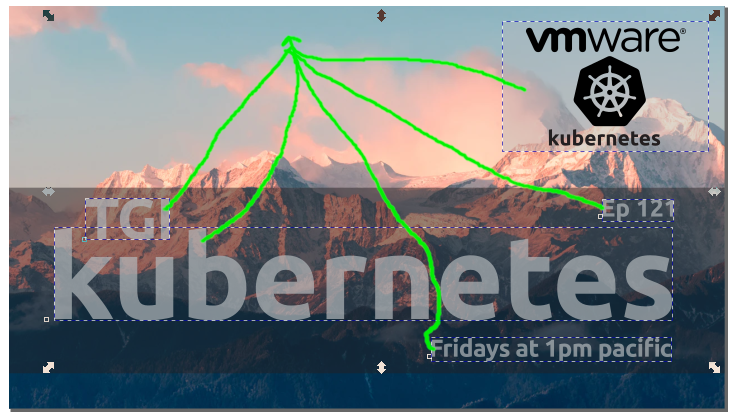](imgs/inkscape-dropper.png)

1. Export using `Menu bar > File > Export PNG Image`.

1. Save to `episodes/${EPISODE_NUMBER}/tgik${EPISODE_NUMBER}.png`.

    [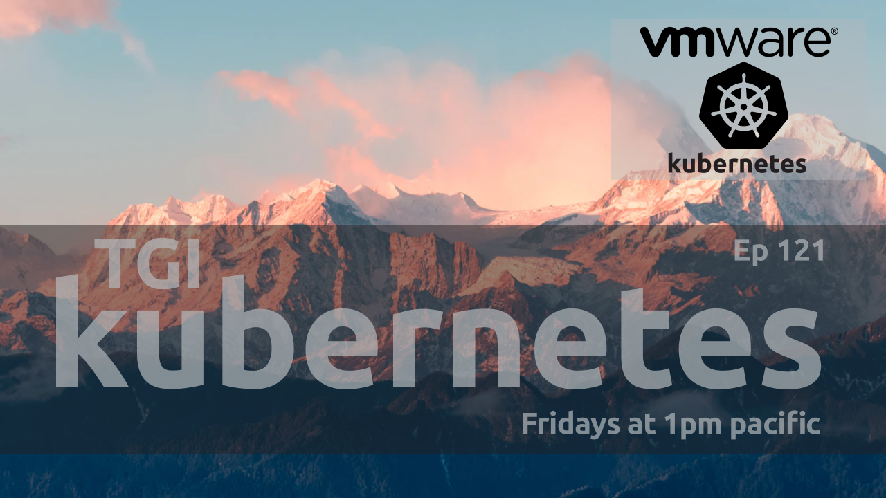](imgs/inkscape-final.png)

## Scheduling on YouTube

1. Ensure you're logged in to the correct Youtube Account (The VMware organization has a youtube account you need to join, and use, by clicking on the upper right corner of the youtube screen, and then logging in as `VMWare Cloud Native Apps`.

1. [Create a new live event by clicking here](https://studio.youtube.com/channel/UCdkGV51Nu0unDNT58bHt9bg/livestreaming).
    * Alternatively: `Youtube Studio > Create Button (top right) > Go Live`.
1. Choose a recent episode and `Reuse Settings`.

    [](imgs/yt-reuse-settings.png)
    > This dialog pops up immediately when clicking the link above.

1. Set the Name, Description, Time (adjust to land in 1PM PT, and use the official TGIK Thumbnail you made earlier)

    [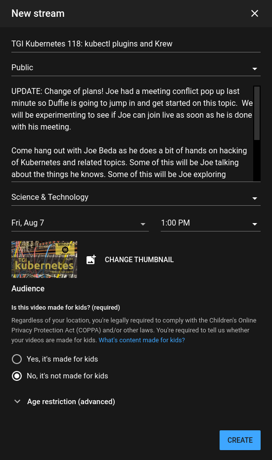](imgs/yt-settings.png)

1. Store the stream key for later use (in OBS for stream settings).

    [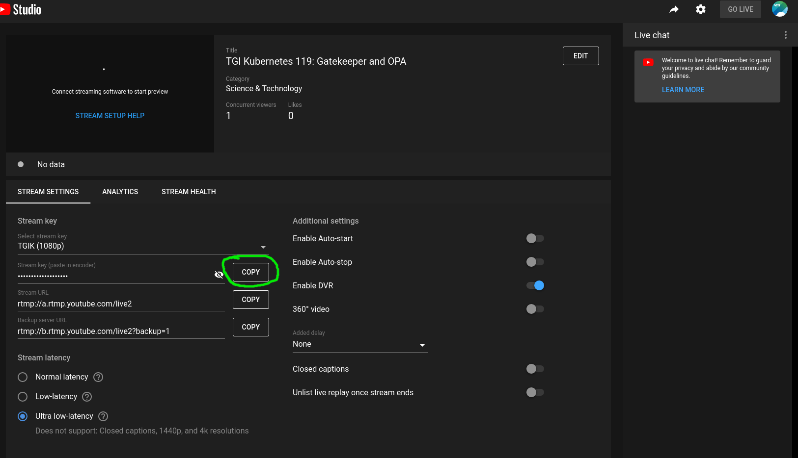](imgs/yt-stream-key.png)

1. Pop out the chat (to get the video id URL, for OBS)...

    [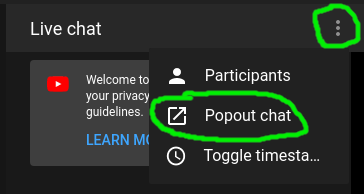](imgs/yt-pop-chat.png)

1. ... Now *store the video id from the chat url* for later use (in OBS for chat).
 
    [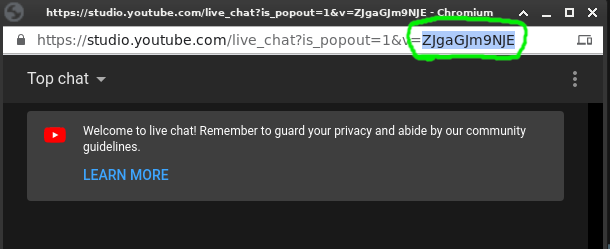](imgs/yt-vid-id.png)

## Updating the TGIK Playlist

Once the event is scheduled, you should add the video to the TGIK playlist so that it shows up at [tgik.io](https://tgik.io).

You can do this from the YouTube Studio UI by selecting "Edit" in the upper right:

[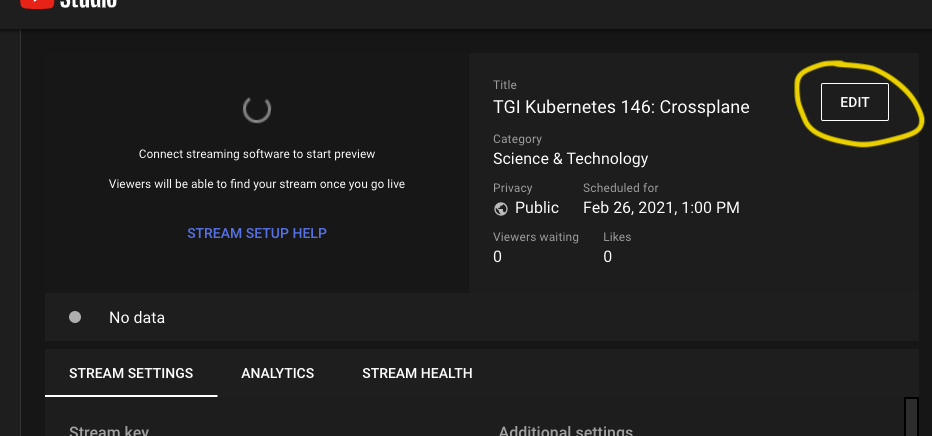](imgs/yt-edit-stream.png)

And then selecting `TGI Kubernetes` from the "Playlists" menu.

[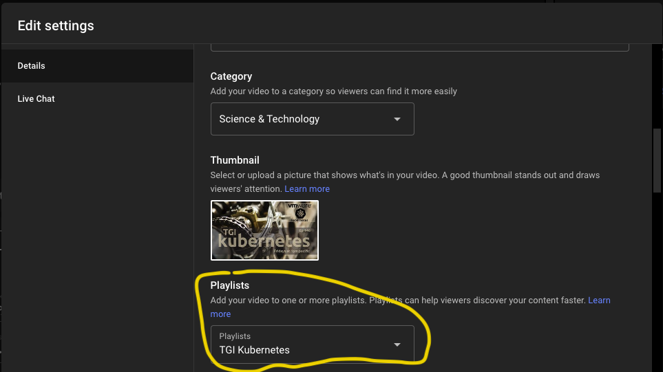](imgs/yt-settings-add-playlist.png)

Alternatively, you can do this via the Scheduled Videos section:

1. Navigate to [scheduled live videos](https://studio.youtube.com/channel/UCdkGV51Nu0unDNT58bHt9bg/videos/live).
1. Click the title card for your episode.

    [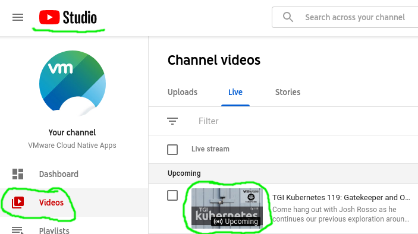](imgs/yt-open-episode.png)

1. Add the episode to the TGIK playlist.

    [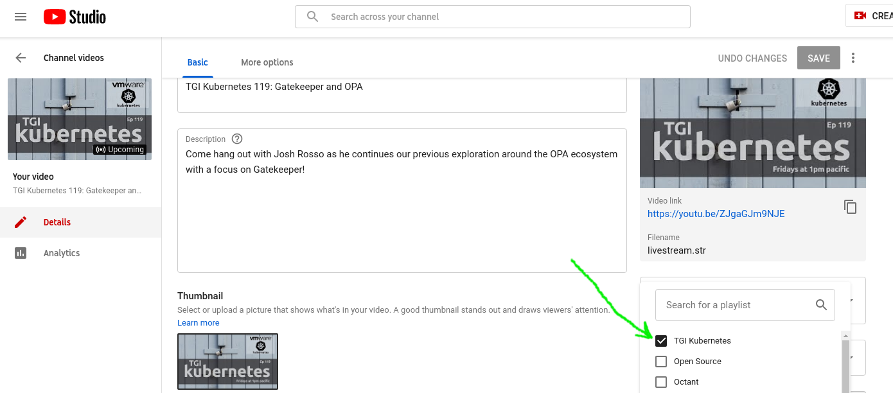](imgs/yt-add-to-playlist.png)

1. Verify the episode shows up at [tgik.io](https://tgik.io).
 
## Creating the Hackmd

1. Navigate to [Hackmd](https://hackmd.io).
    > Create an account if necessary.
1. Import a new note from GitHub.

    [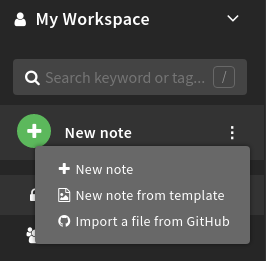](imgs/hack-from-template.png)

1. Import from our existing template

    > This may require you to give Hackmd access to your GitHub.

    * Repo: `vmware-tanzu/tgik`
    * Branch: `master`
    * File: `documentation/template.md`

    [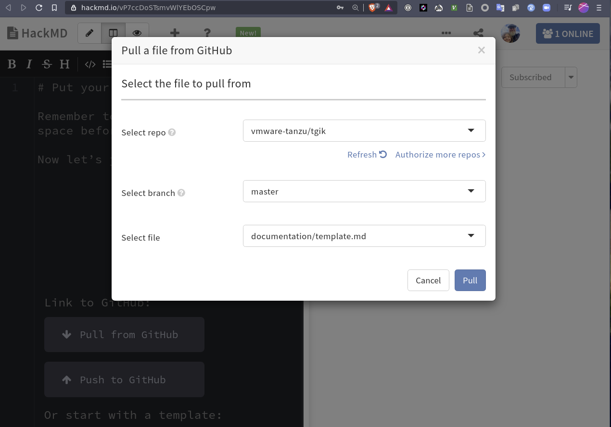](imgs/hack-github-settings.png)

1. Apply all changes.
1. Set the video id found in the  [Scheduling on Youtube section](#scheduling-on-youtube).

    [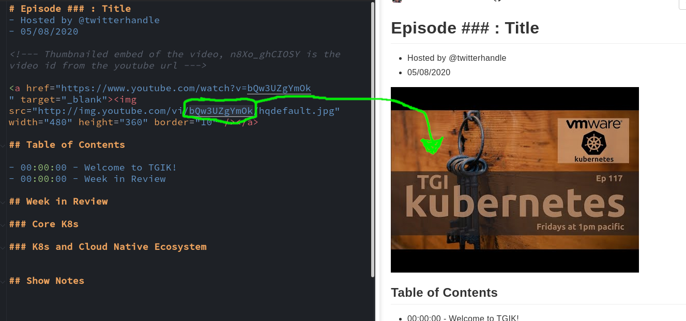](imgs/hack-img-update.png)

1. Update the Hackmd content as desired.


## Creating the links

Log into Rebrandly and create a new link pointing to the YouTube live stream. If you don't have Rebrandly access, reach out for help in [our internal] #tgik channel.

**Create Permanent Episode Link**
```
tgik.io/001 -> youtube.com/watch?v=ixs1-UnWiGU
```

**Update Live Pointer**
```
tgik.io/live -> tgik.io/tgik001
```

**Update Hackmd Pointer**

Make sure to use the `?view` parameter so that folks come to the presented notes
by default

```
tgik.io/notes -> https://hackmd.io/pAPM_qtlTIaCpYZQNF8Y6A?view
```

## Tweeting the Episode

* Tweet out announcing the episode with the hashtag `#TGIK8s`
* Include the **permanent** rebrandly URL generated above
* Include the image created above
* Inform the appropriate humans in the [internal] #tgik channel

<p align="center">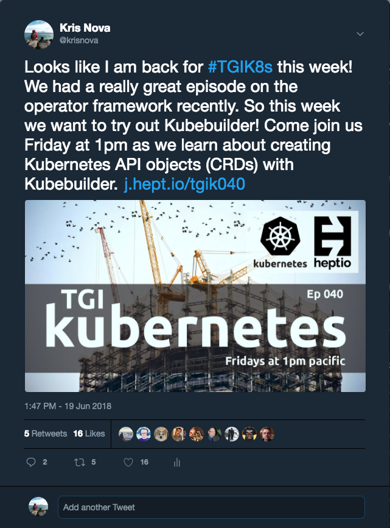</p>

## Setup OBS

#### If you don't already have an OBS configuration for TGIK:

1. Import the OBS profile from the repository.

    * `Profile > Import` choose `obs-config/profiles/TGIK`.
    * `Scene Collection > Import` choose `obs-config/scenes/tgik-macos.json`.
1. After importing check the `Profile` and `Scene Collection` menus to ensure `TGIK` is set.
1. Further configure the scenes to hook up your mic, screen, and webcam.
    > Note: Configuring and tuning OBS is an exercise in itself. If you're a first-time OBS user, consider reaching out to someone in the [internal] #tgik channel to get a walkthrough.

#### Preparing OBS for Stream:

1. Open `File > Settings > Stream`.
1. Paste the stream key found in the [Scheduling on Youtube section](#scheduling-on-youtube).
 
    [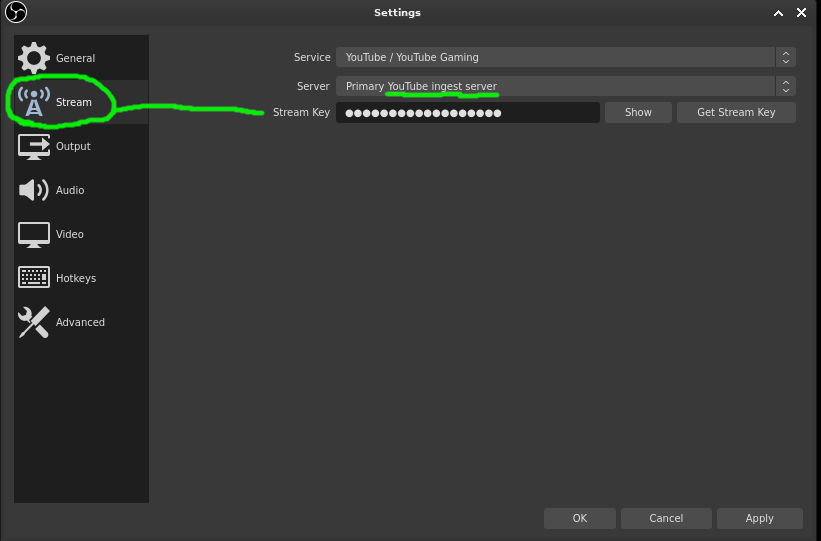](imgs/obs-stream-key.png)

1. Open the YouTube chat source in your scenes.
 
    [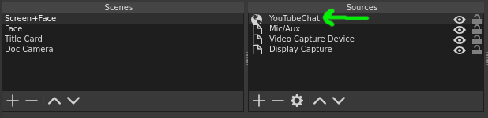](imgs/obs-yt-chat.png)

1. Set the video id found in the  [Scheduling on Youtube section](#scheduling-on-youtube).
 
    [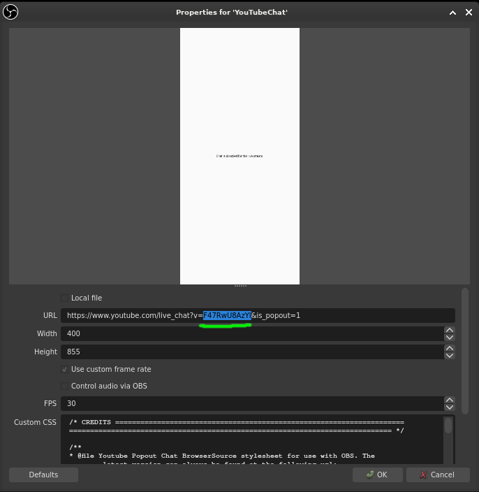](imgs/obs-chat-key.png)

1. Set the title card source to the graphic made in the [Creating the Graphic](#creating-the-graphic).

    [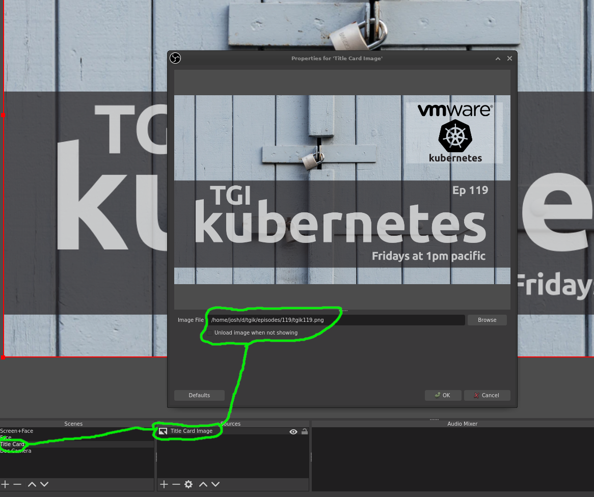](imgs/obs-title-card.png)

## Testing the Stream

Once OBS is configured, you should verify stream quality to YouTube is good. It's important to test this with another at least an hour before you go live on Friday. What follows can be done to self-test well before Friday.

1. Open [YouTube Studio](https://studio.youtube.com).
1. Navigate to Videos.
1. Click the Live tab.
1. Open the Live Control Room for your upcoming stream.

    [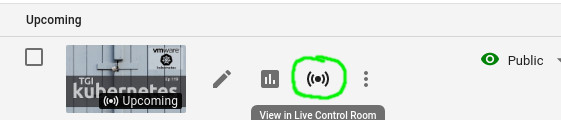](imgs/yt-ctrl-room.png)

1. Start the stream in OBS.
1. Verify:
    * Connection is excellent
    * Test chat message comes through to OBS

    [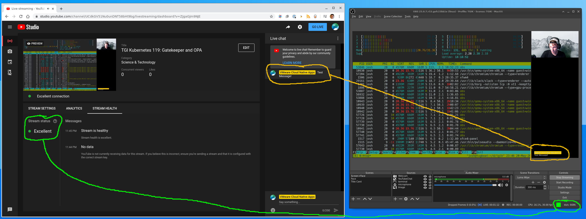](imgs/obs-full-test.png)

## Starting the Stream

1. Follow the steps in [Testing the Stream](#testing-the-stream) above. 
1. Click Go Live in the Live Control Room.

    [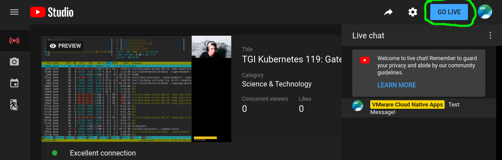](imgs/yt-go-live.png)

1. Break a leg!
 
## Wrapping Up

1. **Stop the stream in OBS and YouTube**.
1. Update the Hackmd with table of contents and other relevant links.
1. Add the hackmd to your episode folder in git.
1. Add any relevant files to your episode folder in git.
1. Create a merge request and merge the episode into GitHub.
    * You can [find an example here](https://github.com/vmware-tanzu/tgik/tree/master/episodes/113).
1. Update the YouTube description with table of contents and link to GitHub.
    * You can [find an example here](https://www.youtube.com/watch?v=an9D2FyFwR0&t=150s).
