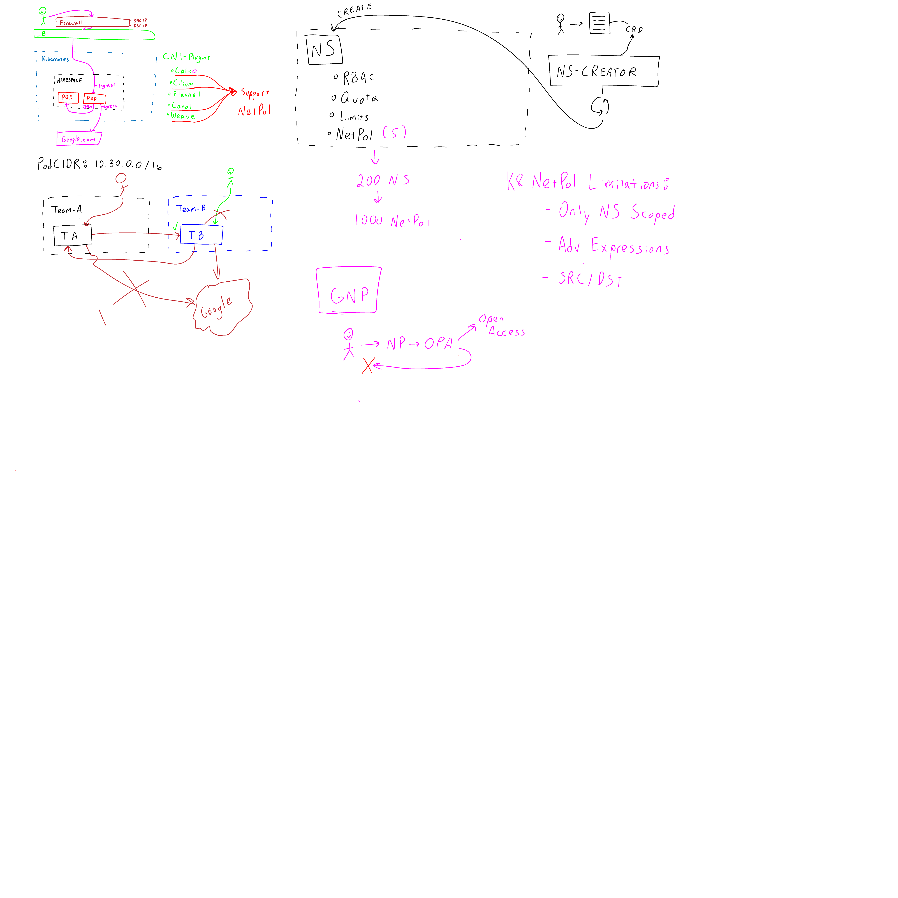

# Episode 085 : Network Policies

- Hosted by @joshrosso
- Recording date: 2019-08-01

## Table of Contents

- 00:00:00 - Welcome to TGIK!
- 00:00:00 - Week in Review

## Week in Review

* [What's new in 1.15 Webinar](https://www.youtube.com/watch?v=eq7dgHjPpzc)
    * hosted by: 1.15 release team
* [Writing Your First Kubernetes Operator](https://medium.com/faun/writing-your-first-kubernetes-operator-8f3df4453234)
    * uses [operator-sdk](https://github.com/operator-framework/operator-sdk)
    * author: Xavier Coulon ([xcoulon](https://twitter.com/xcoulon))
* Reminder of upcoming (1.16) API deprecations
    * [TGI Kubernetes 084: Kubernetes API removal and you](https://www.youtube.com/watch?v=-U79ZLO_37E)
        * hosted by: Duffie Coolie ([@maulion](https://twitter.com/mauilion))
    * [Deprecated APIs Removed In 1.16: Here’s What You Need To Know](https://kubernetes.io/blog/2019/07/18/api-deprecations-in-1-16/)
        * author: Vallery Lancey ([@vllry](https://twitter.com/vllry))

## Show Notes

Whiteboard during session, full size at [whiteboard.png](whiteboard.png).

## Reference Links
- [Ahmet's amazing reference!](https://github.com/ahmetb/kubernetes-network-policy-recipes)
- [kube-iptables-tailer kubernetes blog](https://kubernetes.io/blog/2019/04/19/introducing-kube-iptables-tailer/)
- [net assert by controlplaneio](https://github.com/controlplaneio/netassert)

