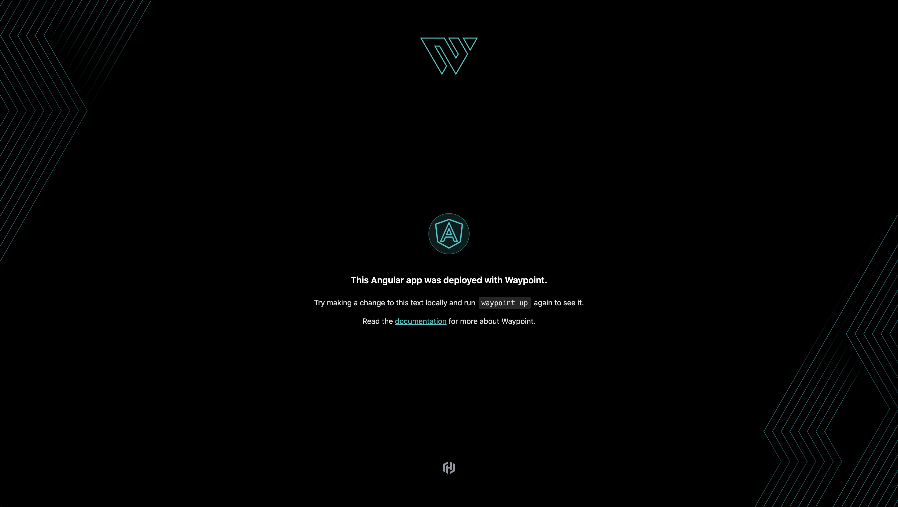

# Angular Waypoint Demo Application

This application deploys an Angular based application, built in Waypoint using the
[pack builder](https://www.waypointproject.io/docs/lifecycle/build#cloud-native-buildpacks)
, with a [Procfile](https://www.waypointproject.io/docs/lifecycle/build#customizing-the-buildpack-launch-command)
to control the hosting server process.

During Waypoint's `build` phase the Buildpack detects the language type and generates the
static files using the `build` command located in the `package.json` file. In this case,
the Buildpack also detects the presence of the Procfile, and uses the command contained
within to launch the server process. In the case of this deployment, it uses NodeJS (the
`node` command) to launch an ExpressJS server to host the static files.

## Customization of the Angular Application

To change aspects of the application, you can edit the `src/app/app.component.html`
component file. SCSS files can be customized by either applying them to the component's
SCSS file at `src/app/app.component.scss` or at the global SCSS file (`styles.scss`) in
the root directory.

## Deploying the Application

To deploy this application, initialize against against a Waypoint server by issuing a
`waypoint init` command. Once registered against a server, and execute the `waypoint up`
command.
